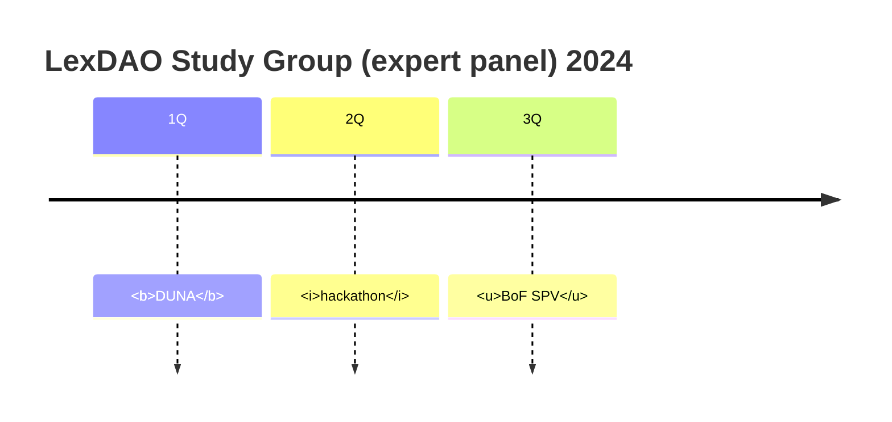

# Evangelism of DLT protocols that bridge wet-ink and firm code

As per constitution,
> We believe that everyone deserves access to justice provided in a quick and efficient manner.
> ... Our mission is to research, develop and **evangelize** first-class legal methods and blockchain protocols that secure rules and promises with code rather than trust.
>
> Creemos que todos merecen acceso a la justicia proporcionada de manera rápida y eficiente.
> ... Nuestra misión es investigar, desarrollar y difundir métodos legales de primera clase y protocolos de blockchain certificados por LexDAO que aseguren reglas y promesas con código en lugar de confianza.

# How case studies are generated, debated and disseminated

```mermaid
block-beta
columns 1
  db(("LexDAO member contribution"))
  blockArrowId6<["&nbsp;&nbsp;&nbsp;"]>(down)
  block:ID
    Communications
    LexEd["LexEd activities"]
    LEETH["Projects (curated/timelocked)"]
  end
  space
  D(("Social media channels"))
  ID --> D
  LEETH --> D
  style B fill:#969,stroke:#333,stroke-width:4px
```

The following event formats are used/preferred:
1. Panel {experts}+moderator
2. Moot Court {team} v {team} = audience(judge)
3. Birds of a Feather (circle + peer review)

# End distribution

- YouTube channel
- github wiki + hackMD (commentary)
- internal transcripts (raw)

# End audience

1. LexDAo paid-up members 
2. Partners (xref timelock)
3. General Public

We strive for creative commons `CC-BY-NC-SA`, however in external LEETH projects there may be publication constraints due to commercial sensitivity in which case there may be a timelock for future release. We may not have control over the timing as Education Circle depend on volunteers to translate, seek funding for graphics & A/V (not our forte) and collate peer feedback. We strive to operate in a do-ocracy with the LexEd circle:
- reaching out to thought leaders
- upholding pedagological standards; and
- partner with institutions for our [experiential learning]() eg hackathons

# Current Cadence



bold = public, italic = in workup, ~~not recorded~~

# POAPs

Attending certain sessions may accumulate POAPs as evidence of contribution to chartered legal engineering status

# Work in Progress

Contact @pmgandi (case studies) or @drllau (case work) for the most recent open bounties.

