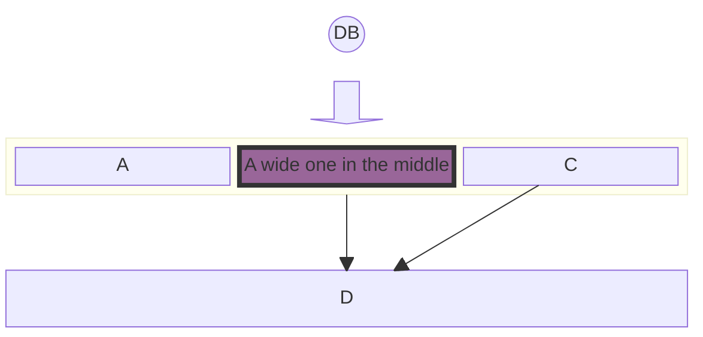

# Evangelism of DLT protocols that bridge wet-ink and firm code

As per constitution,
> We believe that everyone deserves access to justice provided in a quick and efficient manner.
> ... Our mission is to research, develop and **evangelize** first-class legal methods and blockchain protocols that secure rules and promises with code rather than trust.
>
> Creemos que todos merecen acceso a la justicia proporcionada de manera rápida y eficiente.
> ... Nuestra misión es investigar, desarrollar y difundir métodos legales de primera clase y protocolos de blockchain certificados por LexDAO que aseguren reglas y promesas con código en lugar de confianza.

# How case studies are generated, debated and disseminated

